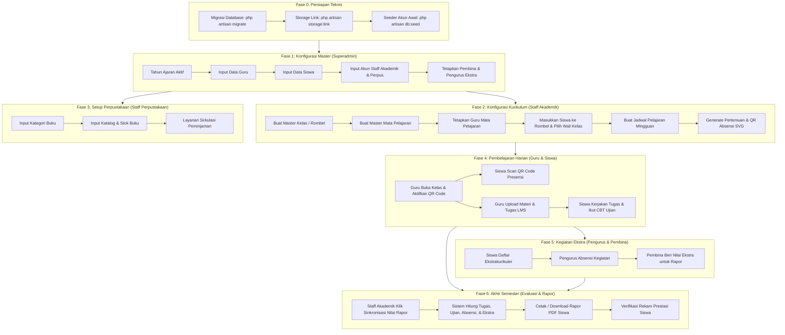

# Panduan Alur Penggunaan Sistem Informasi Sekolah (SST SMPN 2 Kamal)

Dokumen ini menjelaskan alur operasional sistem secara menyeluruh dan berurutan, mulai dari **kondisi awal saat data masih kosong** hingga **sistem siap digunakan secara penuh untuk kegiatan belajar mengajar, presensi QR, ujian CBT, perpustakaan, dan penerbitan rapor**.

---

## 1. Ikhtisar Arsitektur Peran (Role Overview)

Sistem ini memiliki **7 peran (roles)** dengan tanggung jawab yang saling berkaitan:

```
[Superadmin] 
    │── Setup Akun, Master Guru, Siswa, & Staf
    ▼
[Staff Akademik] 
    │── Setup Kelas, Mata Pelajaran, Jadwal, Generate QR Absensi, & Hitung Rapor
    ▼
[Guru & Wali Kelas] 
    │── Aktifkan QR Presensi di Kelas, Kelola LMS, CBT Ujian, & Evaluasi Siswa
    ▼
[Siswa] 
    │── Scan QR Presensi, Kerjakan Tugas LMS, Ujian CBT, & Pinjam Buku
    ▼
[Staff Perpustakaan] 
    │── Kelola Katalog Buku, Peminjaman, & Laporan Perpustakaan
    ▼
[Pembina & Pengurus Ekstra]
    │── Presensi Kegiatan & Penilaian Ekstrakurikuler untuk Rapor
```

---

## 2. Diagram Alur Dependensi Data (Data Flowchart)



---

## 3. Langkah Demi Langkah (Step-by-Step Execution)

### Fase 0: Persiapan Lingkungan & Database (Teknis)
Sebelum web dibuka di browser, pastikan infrastruktur lokal siap:
1. Pastikan server lokal (Laragon / XAMPP) menyala (Apache/Nginx & MySQL).
2. Jalankan migrasi database:
   ```bash
   php artisan migrate
   ```
3. Hubungkan folder penyimpanan publik (wajib untuk QR Code dan cover buku):
   ```bash
   php artisan storage:link
   ```
4. Jalankan seeder akun default:
   ```bash
   php artisan db:seed --class=AkunSeeder
   ```

---

### Fase 1: Setup Master Data Pengguna (Aktor: Superadmin)
**Login**: `/login` menggunakan akun **Superadmin** (Username: `superadmin`, Password: `admin123`).

1. **Pastikan Tahun Ajaran Aktif**:
   - Menu: **Pengaturan / Setting** (`/superadmin/setting` atau database tabel `tahun_ajaran`).
   - Pastikan terdapat tahun ajaran yang berstatus `aktif = 1` (misal: `2024/2025 Semester Ganjil`). Seluruh jadwal, rombel, dan absensi terikat pada semester aktif ini.
2. **Input Data Guru**:
   - Menu: **Kelola Data Guru** (`/superadmin/keloladataguru`).
   - Masukkan seluruh tenaga pendidik (Nama Lengkap, NIP, Nomor WA, Alamat, Email). Sistem otomatis membuatkan akun login guru.
3. **Input Data Siswa**:
   - Menu: **Kelola Data Siswa** (`/superadmin/keloladatasiswa`).
   - Daftarkan seluruh murid baru (Nama Siswa, NISN, Jenis Kelamin, Tanggal Lahir, Alamat, Foto).
4. **Input Akun Staf Pendukung**:
   - Menu: **Kelola Staff Akademik** (`/superadmin/crud_staffakademik`) -> Tambah petugas akademik.
   - Menu: **Kelola Staff Perpustakaan** (`/superadmin/crud_staffperpus`) -> Tambah petugas perpus.
5. **Penetapan Pembina & Pengurus Ekstrakurikuler**:
   - Menu: **Kelola Pembina Ekstra** (`/superadmin/kelola_data_pembina_ekstra`) -> Tetapkan guru sebagai pembina Pramuka, Futsal, PMR, dsb.
   - Menu: **Kelola Pengurus Ekstra** (`/superadmin/crud_pengurusEkstra`) -> Berikan hak akses kepada siswa yang ditugaskan sebagai pengurus ekskul.

---

### Fase 2: Konfigurasi Kurikulum & Akademik (Aktor: Staff Akademik)
**Login**: `/login` menggunakan akun **Staff Akademik** (Username: `akademik`, Password: `akademik123`).

1. **Konfigurasi Tahun Ajaran & Semester Aktif**:
   - Menu: **Master Data > Tahun Ajaran** (`/staff_akademik/tahun-ajaran`).
   - Periksa tahun ajaran yang sedang aktif (misalnya `2024/2025 Semester 1 (Ganjil)`).
   - Jika memasuki semester baru atau tahun ajaran baru:
     - Klik **"Tambah Tahun Ajaran"** untuk mendaftarkan periode (misal: Tahun Mulai `2024`, Tahun Selesai `2025`, Semester `2 (Genap)`).
     - Atau klik tombol **"Aktifkan"** pada periode yang diinginkan. Sistem secara otomatis menonaktifkan periode sebelumnya dan mengalihkan seluruh cakupan jadwal, presensi, dan rapor ke periode aktif tersebut.
2. **Buat Master Kelas / Rombongan Belajar**:
   - Menu: **Master Kelas** (`/staff_akademik/kelas`).
   - Tambahkan nama rombel (contoh: `7A`, `7B`, `8A`, `8B`, `9A`, `9B`).
3. **Buat Master Mata Pelajaran**:
   - Menu: **Master Mata Pelajaran** (`/staff_akademik/mata-pelajaran`).
   - Masukkan daftar mapel (contoh: `Matematika`, `Bahasa Indonesia`, `IPA`, `Bahasa Inggris`, `Pendidikan Agama`).
4. **Penugasan Guru Pengampu Mapel**:
   - Menu: **Guru Mata Pelajaran** (`/staff_akademik/daftar-guru-mata-pelajaran`).
   - Pasangkan guru dengan mata pelajaran yang diampunya (misal: Pak Mulyadi mengajar Matematika).
5. **Pembagian Anggota Kelas & Penetapan Wali Kelas**:
   - Menu: **Manajemen Rombel** (`/staff_akademik/daftarkelas`).
   - Pilih rombel (misal Kelas `7A`), klik **"Kelola Anggota"**:
     - Klik **"Tambah Siswa"** (`/staff_akademik/kelas/{id}/form-tambah-siswa`) -> Centang siswa-siswa yang dimasukkan ke kelas 7A -> Klik **"Tambahkan Siswa Terpilih"**.
     - Klik **"Ubah Wali"** (`/staff_akademik/kelas/{id}/form-edit-wali-kelas`) -> Pilih guru yang menjadi Wali Kelas 7A -> Klik **"Simpan Wali Kelas"**.
6. **Penyusunan Jadwal Pembelajaran**:
   - Menu: **Jadwal Pelajaran** (`/staff_akademik/jadwal-pelajaran`).
   - Klik **"Buat Jadwal Baru"** (`/staff_akademik/jadwal/tambah`):
     - Pilih Kelas tujuan (misal: `7A`).
     - Tentukan Hari (misal: `Senin`), Sesi Jam (`07:00 - 09:00`), dan Guru + Mapel (`Pak Mulyadi — Matematika`).
     - Tambahkan baris sesi berikutnya, lalu klik **"Simpan Jadwal"**.
     - *(Sistem otomatis mengecek dan menolak jika terjadi bentrok ruang kelas atau bentrok jadwal guru di jam yang sama)*.
7. **Pembuatan Sesi Pertemuan & QR Code Presensi**:
   - Menu: **Rekap Absensi** (`/staff_akademik/rekap-absensi`).
   - Cari baris jadwal kelas yang baru dibuat, klik **"Rincian Pertemuan"** (`/staff_akademik/absensi/{id}/rincian-pertemuan`).
   - Pada card **Generate Sesi Pertemuan Otomatis**:
     - Masukkan tanggal pertemuan minggu pertama (misal: `15 Juli 2024`).
     - Masukkan jumlah total pertemuan (misal: `16` kali pertemuan).
     - Klik tombol **"Generate Pertemuan & QR"**.
     - *Hasil*: Sistem otomatis memetakan 16 sesi mingguan ke depan, membuatkan file SVG QR Code untuk masing-masing pertemuan, dan menyiapkan daftar checklist absensi seluruh siswa di kelas tersebut.

---

### Fase 3: Setup Katalog Perpustakaan (Aktor: Staff Perpustakaan)
**Login**: `/login` menggunakan akun **Staff Perpustakaan** (Username: `perpus`, Password: `perpus123`).

1. **Buat Kategori Buku**:
   - Menu: **Kategori Buku** (`/staff_perpus/kategori-buku`) -> Tambahkan kategori (misal: `Buku Pelajaran`, `Fiksi & Cerpen`, `Ensiklopedia`, `Sains`).
2. **Input Katalog Buku**:
   - Menu: **Daftar Buku** (`/staff_perpus/buku`) -> Klik **"Tambah Buku"** (`/staff_perpus/buku/create`).
   - Masukkan Judul Buku, Pengarang, Penerbit, Tahun Terbit, Jumlah Stok, Nomor Rak, dan Cover Buku.
3. **Operasional Sirkulasi**:
   - Menu: **Transaksi Peminjaman** (`/staff_perpus/transaksi`) untuk mencatat peminjaman buku oleh siswa beserta tanggal batas pengembalian.
   - Menu: **Riwayat Transaksi** & **Laporan** untuk audit stok buku masuk, buku rusak, atau buku hilang.

---

### Fase 4: Operasional Pembelajaran Harian (Aktor: Guru & Siswa)

#### A. Presensi Kehadiran di Ruang Kelas (QR Code)
1. **Guru di Kelas**:
   - Guru login di laptop/perangkat kelas (`/guru/absensi`).
   - Klik **"Kelola Pertemuan"** pada mata pelajaran hari itu.
   - Pada sesi yang sedang berlangsung, geser switch status QR menjadi **"Aktif"**.
   - Klik tombol **"Lihat QR"** (atau *"Buka di Tab Baru"*) untuk menampilkan kode QR berukuran besar di layar proyektor kelas.
2. **Siswa Melakukan Scan**:
   - Siswa login ke akun masing-masing di smartphone (`/siswa/absensi`).
   - Buka kamera pemindai dan scan kode QR di proyektor.
   - Status presensi siswa langsung berubah otomatis menjadi **"Hadir"** secara real-time.
3. **Penyelarasan Manual oleh Guru/Staff**:
   - Siswa yang berhalangan hadir (Sakit, Izin, atau Alpa) dapat diperbarui manual statusnya oleh Guru melalui tombol *"Input Presensi"* atau oleh Staff Akademik di menu rincian pertemuan.

#### B. Aktivitas LMS (Materi & Tugas)
1. **Guru**: Membuka menu **LMS** (`/guru/lms`), membuat bab topik pembahasan, mengunggah materi modul pembelajaran (PDF/dokumen), serta membuat tugas berbatas waktu.
2. **Siswa**: Membuka menu **LMS Siswa** (`/siswa/lms`), mengunduh materi, mengerjakan tugas, dan mengunggah file hasil pengerjaan sebelum deadline.
3. **Guru**: Melakukan penilaian dan memberikan skor nilai tugas.

#### C. Ujian Online (CBT)
1. **Guru**:
   - Membuka menu **Ujian** (`/guru/ujian/create_ujian`).
   - Membuat paket soal (Pilihan Ganda & Essay) atau import dari template Excel.
   - Mengatur jadwal mulai ujian, durasi waktu pengerjaan, dan token akses ujian.
2. **Siswa**:
   - Membuka menu **Ujian CBT** (`/siswa/ujian`), memasukkan token, dan mengerjakan soal dalam batas waktu hitung mundur.
3. **Guru**:
   - Membuka menu hasil ujian untuk mengoreksi jawaban essay dan memfinalisasi nilai CBT siswa.

---

### Fase 5: Aktivitas & Penilaian Ekstrakurikuler (Aktor: Siswa, Pengurus, & Pembina)
1. **Pendaftaran Ekstra**: Siswa membuka menu **Ekstrakurikuler** (`/siswa/ekstrakurikuler`) dan mendaftar ke cabang ekskul yang diminati (Pramuka, PMR, Musik, Olahraga).
2. **Presensi Kegiatan**: Pengurus Ekstrakurikuler membuka dashboard ekskul (`/pengurus_ekstra/dashboard`) untuk merekam kehadiran latihan mingguan.
3. **Penilaian oleh Guru Pembina**: Menjelang akhir semester, Guru Pembina Ekstra login (`/pembina_ekstra/penilaian`) untuk memberikan predikat capaian nilai ekstrakurikuler (Sangat Baik / Baik / Cukup) beserta catatan perkembangan karakter siswa yang akan dicantumkan pada rapor.

---

### Fase 6: Akhir Semester & Penerbitan Rapor Akademik (Aktor: Staff Akademik & Wali Kelas)

1. **Rekam Prestasi Siswa**:
   - Siswa atau Staff Akademik menginput piagam kejuaraan, sertifikat perlombaan di menu **Prestasi Siswa** (`/staff_akademik/daftar-prestasi`).
   - Staf memverifikasi dokumen bukti agar otomatis tercatat di portofolio siswa.
2. **Hitung & Sinkronisasi Nilai Rapor**:
   - Staff Akademik membuka menu **Rapor Siswa** (`/staff_akademik/rapor`).
   - Klik tombol **"Hitung & Sinkronkan Nilai"**:
     - *Proses Otomatis (AJAX di latar belakang)*: Sistem mengalkulasi seluruh akumulasi nilai tugas harian, nilai ujian CBT, persentase kehadiran tatap muka, dan nilai ekstrakurikuler siswa untuk tahun ajaran aktif.
3. **Tinjau Lembar Rapor**:
   - Pilih nama siswa pada daftar rombel sebelah kiri.
   - Lembar rapor akademik resmi langsung tertampil di sisi kanan (Transkrip Nilai Mapel, Rata-rata, Nilai Ekstrakurikuler, Catatan Karakter, dan Presensi Kehadiran).
4. **Unduh Lembar Rapor PDF**:
   - Klik tombol **"Unduh Rapor PDF"** untuk mencetak rapor digital resmi yang siap dibagikan kepada wali murid pada saat pembagian hasil belajar.

---

## 4. Tabel Referensi Cepat Akun Default (Default Credentials)

Jika database di-seed menggunakan `AkunSeeder`, gunakan akun-akun bawaan berikut:

| Peran (Role) | Username | Password | Halaman Awal |
| :--- | :--- | :--- | :--- |
| **Superadmin** | `superadmin` atau `admin` | `admin123` | `/superadmin/dashboard` |
| **Staff Akademik** | `akademik` | `akademik123` | `/staff_akademik/dashboard` |
| **Staff Perpustakaan** | `perpus` | `perpus123` | `/staff_perpus/dashboard` |
| **Guru Mata Pelajaran** | `guru` | `guru123` | `/guru/dashboard` |
| **Guru / Guru Lainnya** | `faqih` | `password123` | `/guru/dashboard` |
| **Siswa** | NISN siswa (misal: `1001`) | Sesuai seeder / `password123` | `/siswa/dashboard` |

---

## 5. Ringkasan Tips & Solusi Kendala Operasional (Troubleshooting)

1. **QR Code tidak muncul / gambar pecah**:
   - Pastikan perintah `php artisan storage:link` telah dijalankan sehingga `public/storage` mengarah ke folder `storage/app/public`.
2. **Jadwal bentrok saat disimpan**:
   - Sistem memiliki validasi anti-bentrok. Pastikan guru yang dipilih belum mengajar di kelas lain pada jam yang sama, dan ruang kelas tujuan tidak sedang diisi mata pelajaran lain.
3. **Siswa tidak muncul di dropdown/tabel saat ingin ditambahkan ke kelas**:
   - Hanya siswa yang **belum memiliki kelas aktif** pada semester ini yang muncul di menu tambah siswa. Jika siswa sudah ada di kelas lain, keluarkan terlebih dahulu dari kelas sebelumnya.
4. **Data jadwal guru kosong saat tidak memilih nama guru**:
   - Halaman monitoring jadwal guru telah disempurnakan. Jika filter guru dikosongkan, sistem otomatis menampilkan jadwal seluruh pengajar yang aktif secara terstruktur per guru.
